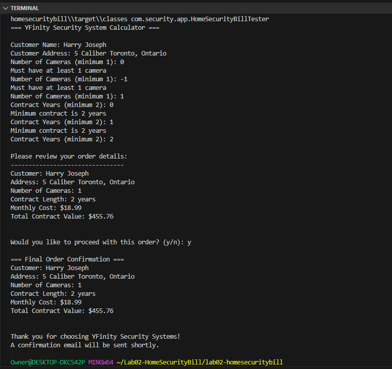
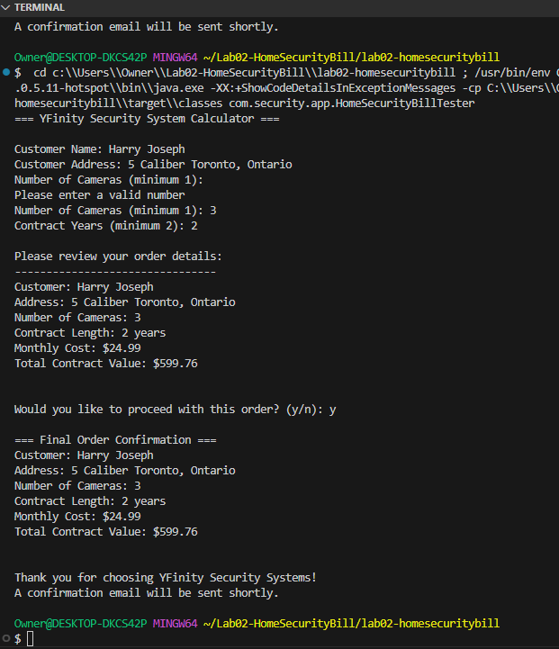

<!--# Lab02-HomeSecurityBill -->

## Synopsis
This project is a Home Security Bill Calculator for YFinity Security Systems. It allows users to input customer details, the number of cameras, and the contract length to calculate the monthly price and total contract value for the security system.

## Class Descriptions and URLs

### [HomeSecurityBillTester.java](src/main/java/com/security/app/HomeSecurityBillTester.java)
This is the main application class that interacts with the user, collects input, creates a `HomeSecurityBill` object, and displays the final bill summary.

### [HomeSecurityBill.java](src/main/java/com/security/model/HomeSecurityBill.java)
This class stores customer and contract information, calculates the monthly price and total contract value, and provides a summary of the bill.

### [BillCalculator.java](src/main/java/com/security/util/BillCalculator.java)
This class handles all pricing calculations, including the monthly price based on the number of cameras and the total contract value based on the contract length.

### [HomeSecurityInputvalidation.java](src/main/java/com/security/validation/HomeSecurityInputvalidation.java)
This utility class provides methods for validating user input, including strings, camera counts, contract years, and confirmation prompts.

## Output

    
    

## Directory and File Structure
<pre>
Lab02-HomeSecurityBill/
├── src/
│   ├── main/
│   │   ├── java/
│   │   │   ├── com/
│   │   │   │   ├── security/
│   │   │   │   │   ├── app/
│   │   │   │   │   │   └── HomeSecurityBillTester.java
│   │   │   │   │   ├── model/
│   │   │   │   │   │   └── HomeSecurityBill.java
│   │   │   │   │   ├── util/
│   │   │   │   │   │   └── BillCalculator.java
│   │   │   │   │   └── validation/
│   │   │   │   │       └── HomeSecurityInputvalidation.java
│   │   ├── resources/
│   │   │   └── images/
│   │   │       └── output.png
├── readme.md
</pre>

### - Author Harry Joseph [Github](https://github.com/hjoseph777)
### - January 19, 2025
